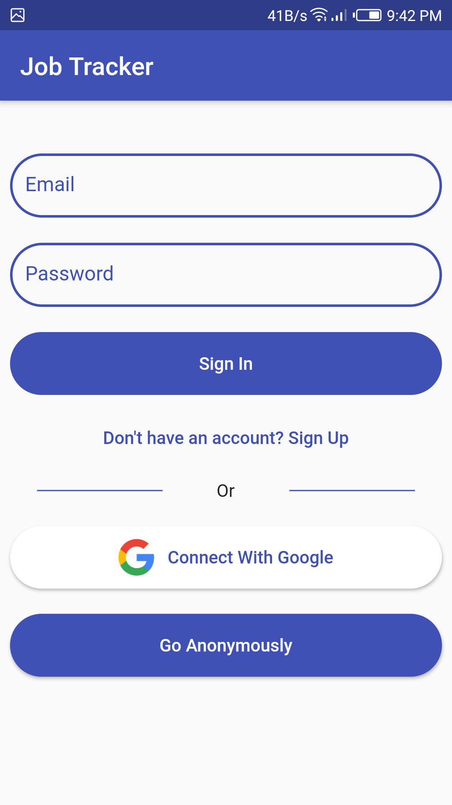
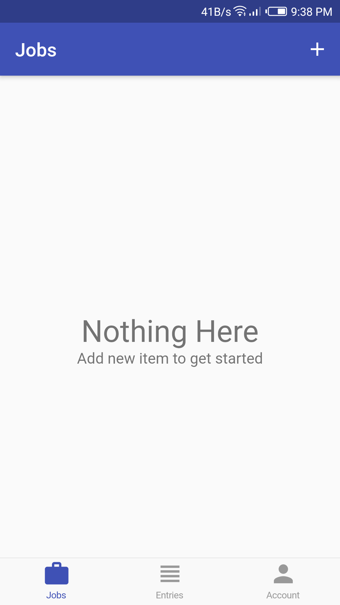
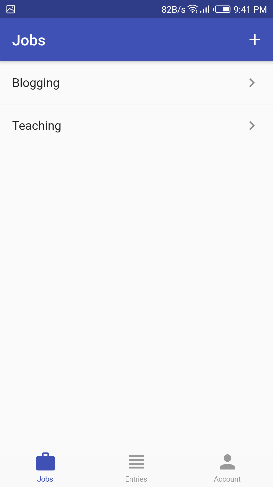

# Job Tracker Flutter App

A flutter app that tracks jobs and calculate the net time and revenue.

## Tools
- Authentication: Firebase Authentication
- Backend: Firebase Firestore
- State management: 
   * Bloc Design Pattern (not Bloc packages) (Streams and StreamBuilder - RxDart)
   * Provider Package with ValeNotifier and ChangeNotifier
- Packages:
   * firebase_core
   * firebase_auth
   * cloud_firestore
   * google_sign_in
   * rxdart
   * provider
   * intl
 

## Notes
 - In this application the services layer, data layer and UI layer are separated.
 - This application includes advanced streams operation with reactive programming (RxDart).

## Reference
 - I have accomplished this application by following this course: https://courses.codewithandrea.com/p/flutter-firebase-time-tracker-app
 

## Screenshots

<table>
  <tr>
    <td>Authentication</td>
     <td>Home</td>
     <td>Add / Edit Jobs</td>
  </tr>
  <tr>
    <td></td>
    <td></td>
    <td></td>
  </tr>
 </table>
      
<table>
  <tr>
    <td>empty Job Entries</td>
     <td>Create / Edit Entry</td>
     <td>Job Entries</td>
  </tr>
  <tr>
    <td></td>
    <td></td>
    <td></td>
  </tr>
 </table>
 
 
 <table>
  <tr>
    <td>Jobs</td>
     <td>All Entries</td>
     <td>User Account</td>
  </tr>
  <tr>
    <td></td>
     <td></td>
     <td></td>
  </tr>
 </table>
 
 
 <table>
  <tr>
    <td>Logout</td>
  </tr>
  <tr>
    <td></td>
  </tr>
 </table>
